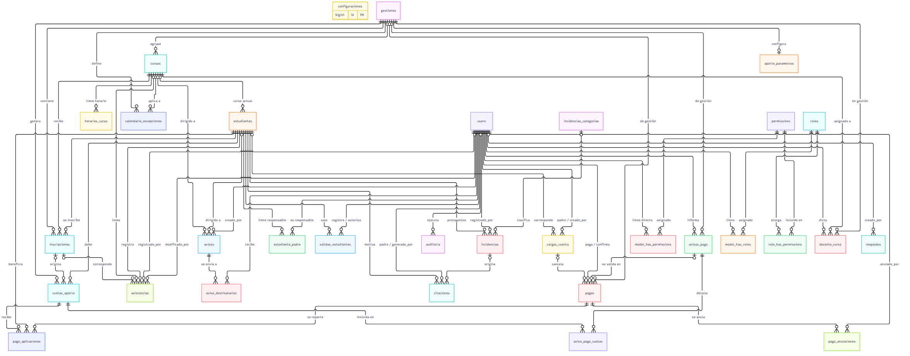
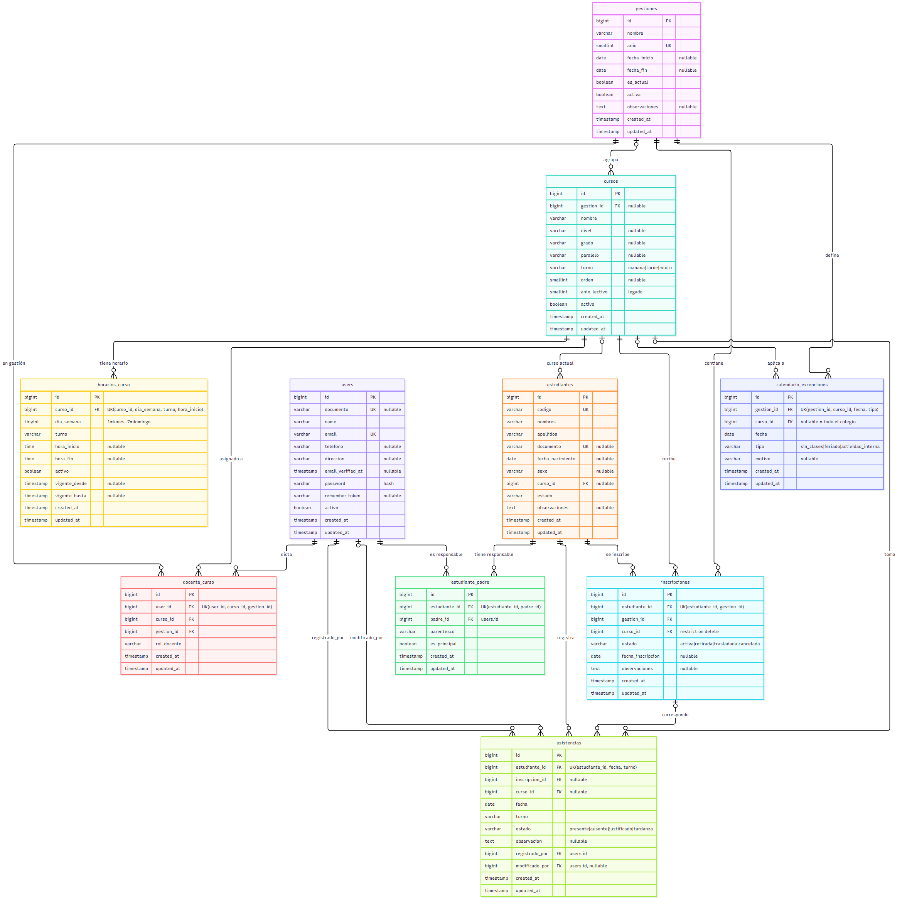
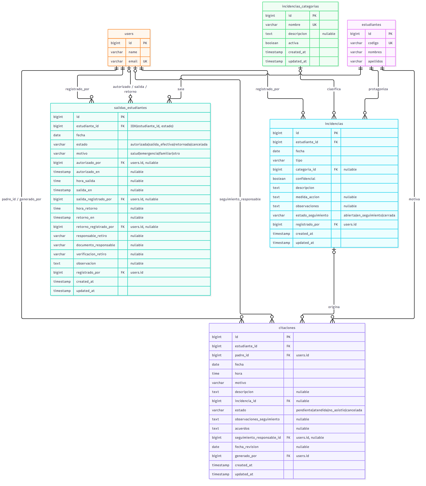
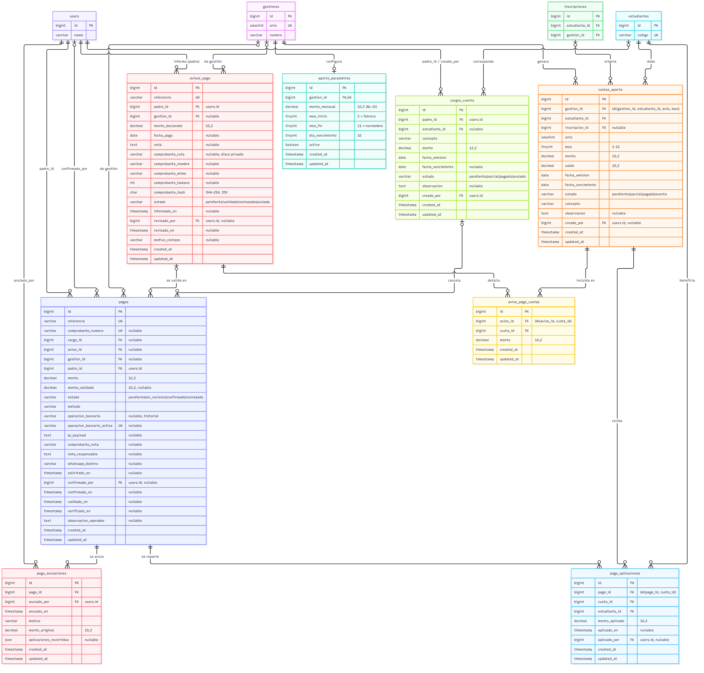
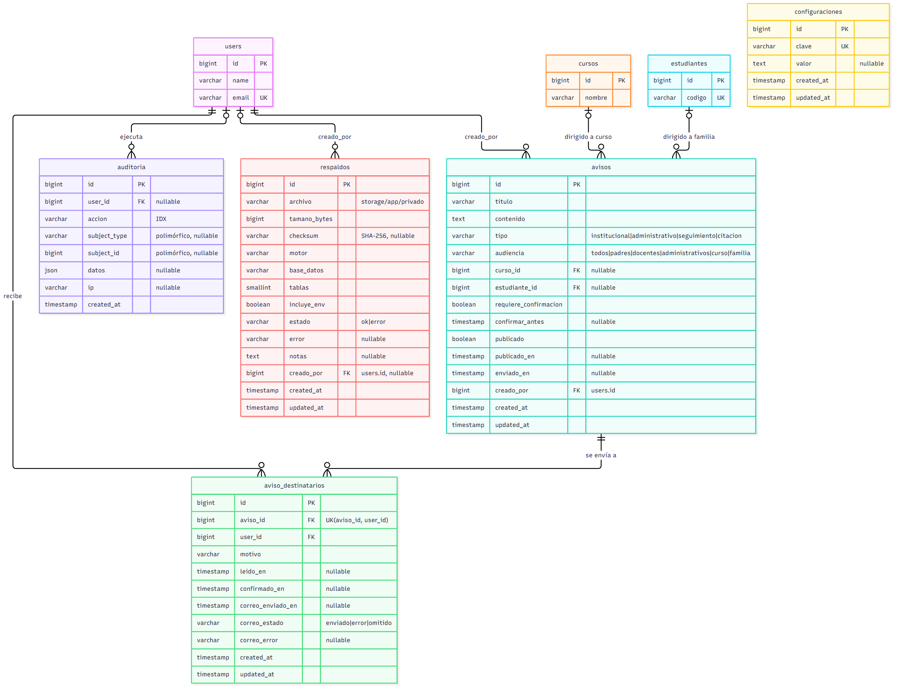
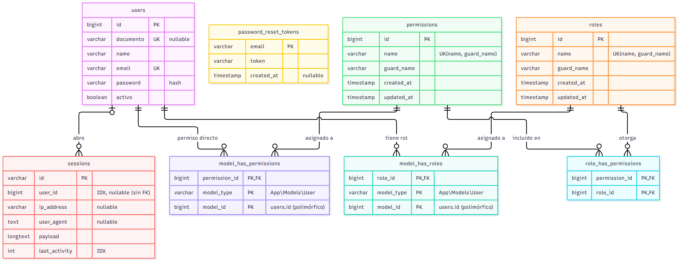

# Modelo entidad-relación del SGE-Arajuruana

En este documento se presenta el modelo entidad-relación (E-R) de la base de datos MySQL del Sistema de Gestión Educativa de la Unidad Educativa Arajuruana. El modelo se obtuvo directamente de las migraciones de Laravel (`database/migrations`), de modo que refleja exactamente las tablas, columnas, claves e índices que se crean al instalar el sistema.

Cada diagrama está disponible en tres formatos dentro de esta carpeta: el código fuente Mermaid (`.mmd`), una imagen vectorial (`.svg`) y una imagen PNG en alta resolución.

## Cómo leer los diagramas

- Cada caja es una tabla. En cada fila se indica el tipo de dato, el nombre de la columna, la clave (`PK` clave primaria, `FK` clave foránea, `UK` valor único) y una nota (valores posibles, si acepta nulos, a qué tabla apunta, etc.).
- Las restricciones únicas compuestas se anotan en la primera columna que las forma, por ejemplo `UK(estudiante_id, gestion_id)`.
- Las líneas usan la notación "pata de gallo" (*crow's foot*):

| Símbolo | Significado |
|---|---|
| `\|\|` | exactamente uno (la clave foránea es obligatoria) |
| `o\|` | cero o uno (la clave foránea acepta nulos) |
| `o{` | cero o muchos |

Por ejemplo, `gestiones ||--o{ inscripciones` se lee: "cada inscripción pertenece a exactamente una gestión, y una gestión puede tener cero o muchas inscripciones".

## Resumen de la base de datos

La base de datos tiene **27 tablas de negocio** (incluida `users`) organizadas en cinco módulos, más las tablas de seguridad de spatie/laravel-permission y las tablas internas de Laravel.

| Módulo | Tablas |
|---|---|
| Académico | `gestiones`, `cursos`, `estudiantes`, `estudiante_padre`, `inscripciones`, `docente_curso`, `horarios_curso`, `calendario_excepciones`, `asistencias` |
| Convivencia | `salidas_estudiantes`, `incidencias_categorias`, `incidencias`, `citaciones` |
| Económico | `aporte_parametros`, `cuotas_aporte`, `avisos_pago`, `aviso_pago_cuotas`, `pagos`, `pago_aplicaciones`, `pago_anulaciones`, `cargos_cuenta` |
| Comunicaciones y administración | `avisos`, `aviso_destinatarios`, `auditoria`, `respaldos`, `configuraciones` |
| Seguridad y acceso | `users`, `roles`, `permissions`, `model_has_roles`, `model_has_permissions`, `role_has_permissions`, `sessions`, `password_reset_tokens` |

Las tablas `cache`, `cache_locks`, `jobs`, `job_batches` y `failed_jobs` son de uso interno de Laravel (caché y colas), no tienen relaciones con el resto y no se incluyen en los diagramas.

## 1. Diagrama E-R general

Muestra todas las entidades y sus relaciones sin atributos, para apreciar la estructura completa. Las entidades centrales son `users`, `estudiantes`, `cursos` y `gestiones`: casi todas las demás tablas dependen de ellas. La tabla `users` representa a todas las personas con cuenta en el sistema (administración, docentes y responsables familiares); el rol de cada una se define con spatie/laravel-permission, por eso una misma tabla aparece como "padre", "docente" o "registrado por" según la relación.



## 2. Módulo académico

La `gestion` representa el año escolar y agrupa a los cursos, las inscripciones, las asignaciones docentes y las excepciones del calendario. La tabla `inscripciones` separa la identidad del estudiante de su paso por cada año: une un estudiante con un curso dentro de una gestión, y la restricción `UK(estudiante_id, gestion_id)` impide inscribirlo dos veces en el mismo año. Las relaciones de muchos a muchos se resuelven con tablas intermedias: `estudiante_padre` (estudiantes y sus responsables) y `docente_curso` (docentes y cursos por gestión). La asistencia se registra por estudiante, fecha y turno, y guarda quién la registró y quién la modificó.



## 3. Módulo de convivencia

Una `salida_estudiante` guarda el flujo completo de una salida anticipada (autorizada, salida efectiva, retornada o cancelada) y por eso tiene cuatro claves foráneas hacia `users`: quién la registró, quién la autorizó, quién registró la salida y quién registró el retorno. Cada `incidencia` puede clasificarse con una categoría configurable y marcarse como confidencial. Una `citacion` siempre se dirige al responsable del estudiante y puede originarse en una incidencia (relación opcional).



## 4. Módulo económico

`aporte_parametros` tiene una relación uno a uno con `gestiones` (la columna `gestion_id` es única) y define el monto mensual y los meses de cobro. A partir de esos parámetros se generan las `cuotas_aporte`, una por estudiante y mes (`UK(gestion_id, estudiante_id, anio, mes)`). Cuando la familia informa un pago se crea un `aviso_pago` con su comprobante, y en `aviso_pago_cuotas` se indica qué cuotas pretende cancelar. Al validarlo, administración registra un `pago`, que se reparte entre las cuotas mediante `pago_aplicaciones` (un pago puede cubrir varios meses o varios hermanos). Si un pago se anula, queda constancia en `pago_anulaciones`. `cargos_cuenta` conserva los cargos extraordinarios que no forman parte del aporte mensual. Los montos se guardan como `DECIMAL`, nunca como números de punto flotante.



## 5. Comunicaciones y administración

Un `aviso` puede dirigirse a toda la comunidad, a un curso (`curso_id`) o a la familia de un estudiante (`estudiante_id`). Al publicarlo se crea un registro en `aviso_destinatarios` por cada usuario que debe recibirlo, donde se guarda si lo leyó, si confirmó la lectura y el resultado del envío por correo. `auditoria` registra las acciones sensibles usando una relación polimórfica (`subject_type`, `subject_id`) que puede apuntar a cualquier tabla. `respaldos` lleva el registro de las copias de seguridad y `configuraciones` guarda parámetros generales como pares clave-valor.



## 6. Seguridad y acceso

Los roles y permisos se manejan con spatie/laravel-permission. `model_has_roles` y `model_has_permissions` son relaciones polimórficas (`model_type`, `model_id`) que en este sistema siempre apuntan a `users`; `role_has_permissions` asocia cada rol con sus permisos. `sessions` guarda las sesiones abiertas (su `user_id` está indexado pero no tiene clave foránea) y `password_reset_tokens` los tokens de recuperación de contraseña.



## Reglas de borrado de las claves foráneas

Las migraciones definen qué ocurre con los registros relacionados cuando se elimina un registro padre:

- **Cascada (`cascadeOnDelete`)**: se usa cuando el registro hijo no tiene sentido sin el padre, por ejemplo las asistencias, incidencias o cuotas de un estudiante eliminado.
- **Poner en nulo (`nullOnDelete`)**: se usa en las claves opcionales y en las de trazabilidad (`modificado_por`, `confirmado_por`, `auditoria.user_id`, etc.), para conservar el historial aunque se elimine el usuario o el registro relacionado.
- **Restringir (`restrictOnDelete`)**: solo en `inscripciones.curso_id`; no se puede eliminar un curso que tenga estudiantes inscritos.

## Cómo regenerar las imágenes

Desde la carpeta `docs/er`:

```powershell
npx -y @mermaid-js/mermaid-cli -i 01-er-general.mmd -o 01-er-general.svg -b white
npx -y @mermaid-js/mermaid-cli -i 01-er-general.mmd -o 01-er-general.png -b white -s 3
```
