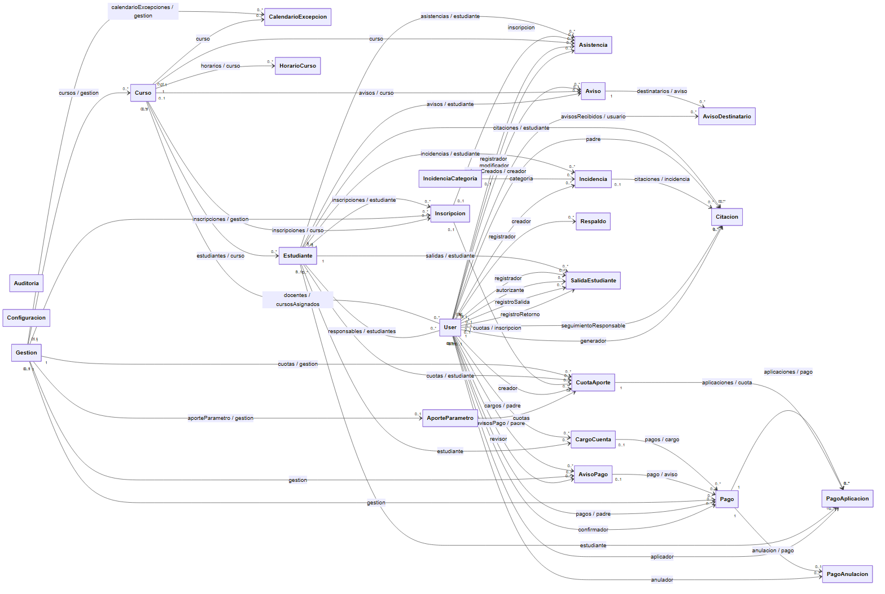
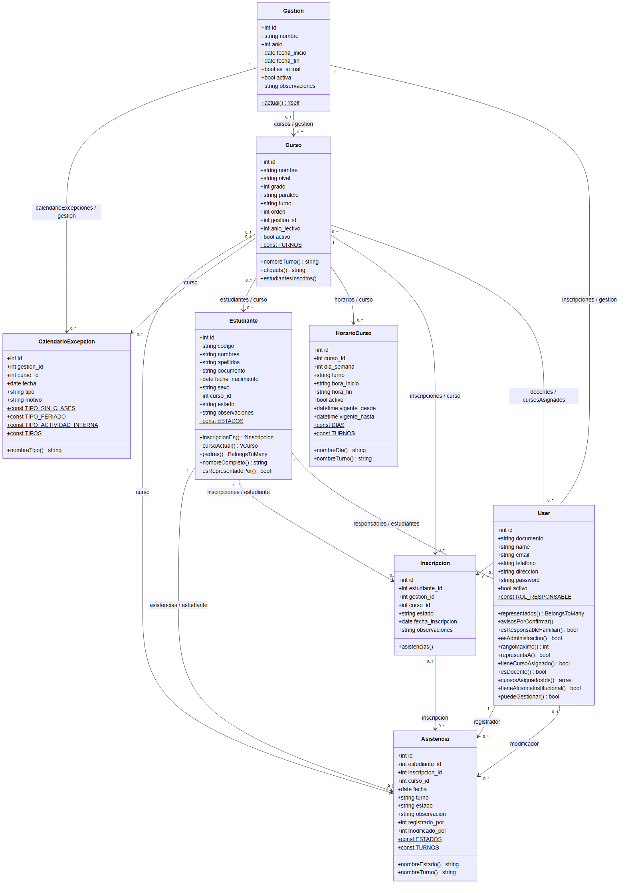
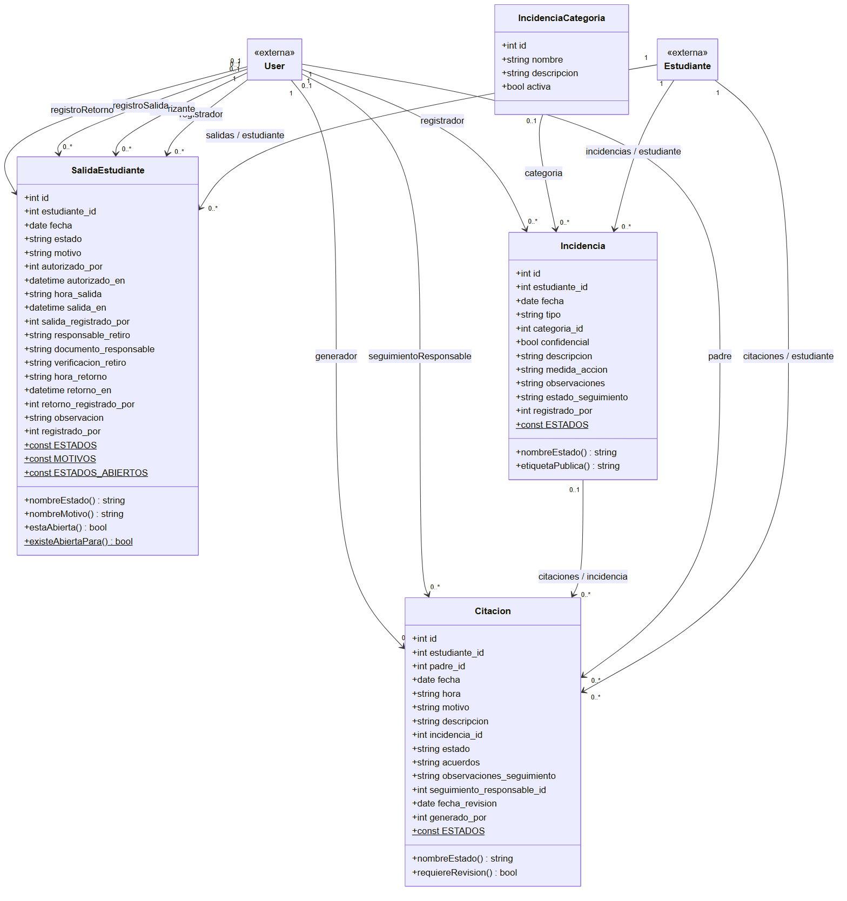
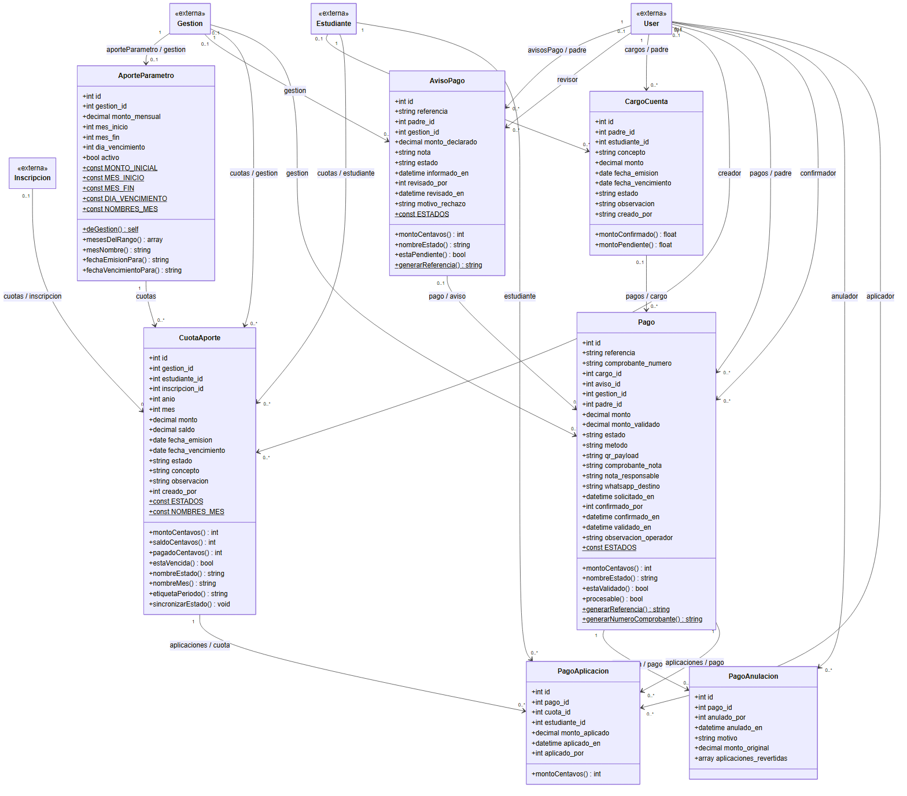
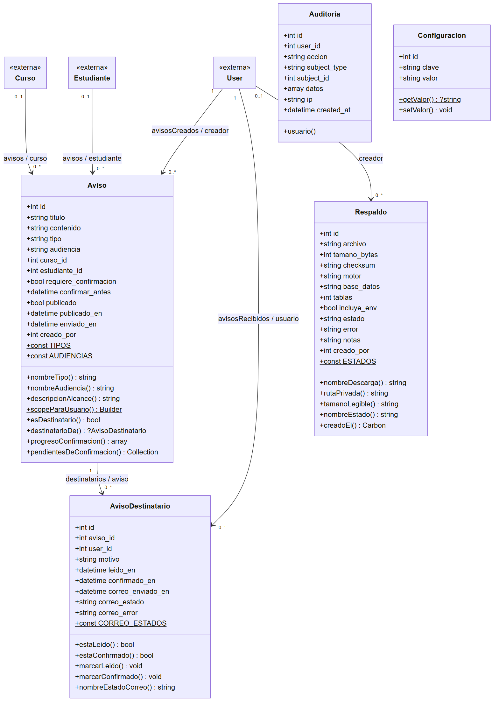
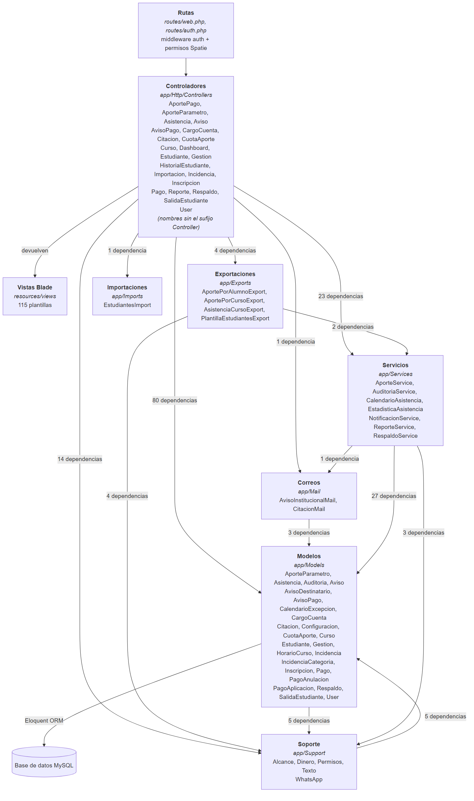

# Diagramas UML del SGE-Arajuruana

En este documento se presentan los diagramas UML del Sistema de Gestión Educativa de la Unidad Educativa Arajuruana. Los diagramas no se dibujaron a mano: se obtuvieron directamente del código fuente del sistema, para asegurarnos de que reflejan lo que realmente está programado y no una idea aproximada.

Para lograrlo seguimos dos pasos:

1. Se analizó automáticamente todo el código del proyecto (263 archivos de código) y se construyó un grafo de dependencias con 1.298 nodos y 3.110 relaciones (clases, métodos, llamadas e importaciones). De ese grafo se obtuvieron las dependencias reales entre las capas del sistema.
2. De los modelos Eloquent (`app/Models`) se leyeron los atributos (`$fillable`), los tipos de dato (`casts()`), las constantes, los métodos públicos y las relaciones (`belongsTo`, `hasMany`, `hasOne`, `belongsToMany`). Las multiplicidades se ajustaron revisando en las migraciones qué claves foráneas aceptan valores nulos: cuando una clave foránea es opcional, el extremo correspondiente se marca como `0..1` en lugar de `1`.

Cada diagrama está disponible en tres formatos dentro de esta carpeta: el código fuente Mermaid (`.mmd`), una imagen vectorial (`.svg`) y una imagen PNG en alta resolución para incluirla en el documento de la tesis.

## Cómo leer los diagramas

- Cada caja es una clase del sistema. En la parte superior están los atributos con su tipo y, debajo, los métodos públicos con su tipo de retorno.
- Los elementos subrayados son estáticos (constantes de la clase o métodos como `Pago::generarReferencia()`).
- Una flecha `A "1" --> "0..*" B` indica que un registro de A puede tener muchos registros de B y que cada B pertenece a un A. El texto de la flecha muestra el nombre de los métodos de relación en ambos lados (por ejemplo, `inscripciones / estudiante`).
- Una línea sin flecha con `0..*` en ambos extremos representa una relación de muchos a muchos, que en la base de datos se resuelve con una tabla intermedia.
- En los diagramas por módulo, las clases marcadas como `«externa»` pertenecen a otro módulo y solo se muestran para que se entienda con qué se conectan.

## 1. Diagrama de clases general del dominio

Este diagrama muestra las 24 clases del modelo de datos y las 56 asociaciones que existen entre ellas, sin detallar atributos para que se pueda apreciar la estructura completa de un vistazo. Se observa que `User`, `Estudiante`, `Curso` y `Gestion` son las clases centrales: casi todos los módulos dependen de ellas, porque toda la información del colegio gira alrededor de quién es el estudiante, en qué curso está, en qué gestión escolar y qué usuario registró cada acción.



## 2. Módulo académico

Aquí se encuentran las clases que organizan la vida académica del colegio. La `Gestion` representa el año escolar y agrupa a los cursos, las inscripciones y las excepciones del calendario (feriados, días sin clases). La `Inscripcion` une a un `Estudiante` con un `Curso` dentro de una gestión, y gracias a ella conservamos el historial del estudiante año tras año. La `Asistencia` se registra por estudiante y guarda quién la registró y quién la modificó, para tener trazabilidad. Los docentes se relacionan con sus cursos mediante una relación de muchos a muchos (`docentes / cursosAsignados`), y los padres o responsables con sus hijos de la misma forma (`responsables / estudiantes`).



## 3. Módulo de convivencia

Este módulo reúne el control de salidas, las incidencias y las citaciones. Una `SalidaEstudiante` guarda todo el recorrido de una salida anticipada: quién la registró, quién la autorizó y quién registró la salida y el retorno, por eso tiene cuatro asociaciones con `User`. Cada `Incidencia` pertenece a un estudiante y puede clasificarse con una `IncidenciaCategoria`. Una `Citacion` puede generarse a partir de una incidencia (por eso esa relación es opcional, `0..1`) y siempre está dirigida al responsable del estudiante.



## 4. Módulo económico

Este es el módulo con más reglas de negocio. El `AporteParametro` define, para cada gestión, el monto mensual del aporte y el rango de meses; a partir de él se generan las `CuotaAporte` de cada estudiante. Cuando el padre informa un pago se crea un `AvisoPago`, que luego revisa la administración. El `Pago` confirmado se reparte entre las cuotas pendientes mediante `PagoAplicacion`, lo que permite, por ejemplo, que un solo pago cubra las cuotas de dos hermanos. Si un pago tiene que anularse, se registra una `PagoAnulacion` con las aplicaciones que fueron revertidas, de modo que nunca se pierde el rastro del dinero. `CargoCuenta` representa los cargos adicionales a la cuenta de un responsable.



## 5. Módulo de comunicaciones y administración

Un `Aviso` puede estar dirigido a toda la comunidad, a un curso o a un estudiante concreto. Al publicarlo, el sistema crea un `AvisoDestinatario` por cada usuario que debe recibirlo, y en ese registro se guarda si lo leyó o confirmó. Las clases `Respaldo`, `Auditoria` y `Configuracion` dan soporte a la administración del sistema: copias de seguridad de la base de datos, el registro de las acciones importantes de los usuarios y los parámetros generales (por ejemplo, el número de WhatsApp para pagos).



## 6. Diagrama de paquetes: arquitectura por capas

Este diagrama se construyó a partir de las relaciones del grafo de dependencias del código y muestra cómo se organiza el código siguiendo el patrón Modelo-Vista-Controlador de Laravel, al que le agregamos una capa de servicios. Los números de cada flecha indican cuántas dependencias reales (llamadas, referencias o importaciones) hay de una capa hacia otra.

- Las **rutas** reciben las peticiones del navegador y aplican el middleware de autenticación y los permisos de Spatie antes de llegar al controlador.
- Los **controladores** coordinan cada caso de uso: validan los datos, consultan los modelos y devuelven una vista.
- Los **servicios** concentran la lógica más compleja para no repetirla en varios controladores: el cálculo de cuotas y pagos (`AporteService`), la auditoría, las notificaciones, los reportes, los respaldos y las estadísticas de asistencia.
- La capa de **soporte** contiene clases utilitarias: `Dinero` (cálculos en centavos enteros para evitar errores de redondeo), `Permisos` y `Alcance` (qué puede ver cada rol), `Texto` y `WhatsApp`.
- Los **modelos** representan las tablas de la base de datos MySQL mediante el ORM Eloquent.



### Dependencias de cada controlador

La siguiente tabla, obtenida del mismo grafo, detalla qué servicios, utilidades y modelos utiliza cada controlador.

| Controlador | Servicios y utilidades | Modelos |
|---|---|---|
| AportePagoController | AporteService, Dinero | CuotaAporte, Gestion, Pago, User |
| AporteParametroController | AuditoriaService | AporteParametro, Gestion |
| AsistenciaController | AuditoriaService, CalendarioAsistencia | Asistencia, CalendarioExcepcion, Curso, Gestion, Inscripcion |
| AvisoController | Alcance, AuditoriaService, NotificacionService | Aviso, Curso, Estudiante, Gestion |
| AvisoPagoController | AporteService, AuditoriaService, Dinero | AvisoPago, CuotaAporte, Gestion, User |
| CargoCuentaController | — | CargoCuenta, Estudiante, User |
| CitacionController | Alcance, AuditoriaService, CitacionMail, WhatsApp | Citacion, Estudiante, Incidencia, User |
| CuotaAporteController | Alcance, AporteService, AuditoriaService | AporteParametro, CuotaAporte, Estudiante, Gestion |
| CursoController | AuditoriaService | CalendarioExcepcion, Curso, Gestion, HorarioCurso, User |
| DashboardController | Alcance, AporteService | Asistencia, AvisoPago, CargoCuenta, Citacion, CuotaAporte, Estudiante, Gestion, Incidencia, Pago, SalidaEstudiante, User |
| EstudianteController | Alcance, AuditoriaService | Curso, Estudiante, User |
| GestionController | AuditoriaService | Gestion |
| HistorialEstudianteController | Alcance | Estudiante, Gestion |
| ImportacionController | AuditoriaService, EstudiantesImport, PlantillaEstudiantesExport | Curso, Estudiante, Gestion, Inscripcion |
| IncidenciaController | Alcance, AuditoriaService | Estudiante, Incidencia, IncidenciaCategoria |
| InscripcionController | Alcance, AuditoriaService | Curso, Estudiante, Gestion, Inscripcion |
| PagoController | — | CargoCuenta, Configuracion, Pago |
| ReporteController | Alcance, ReporteService, AportePorAlumnoExport, AportePorCursoExport, AsistenciaCursoExport | Asistencia, CargoCuenta, Citacion, Curso, Estudiante, Gestion, Incidencia, Pago, SalidaEstudiante |
| RespaldoController | AuditoriaService, RespaldoService | Respaldo |
| SalidaEstudianteController | Alcance, AuditoriaService | Estudiante, SalidaEstudiante, User |
| UserController | AuditoriaService, Permisos | User |

En la tabla no aparecen `ProfileController` ni los controladores de autenticación (`app/Http/Controllers/Auth`), porque provienen de Laravel Breeze y solo trabajan con el usuario que inició sesión.

## Cómo regenerar los diagramas

Si el código cambia, los diagramas se pueden volver a generar. Los archivos `.mmd` se pueden editar y abrir en cualquier visor de Mermaid (GitHub y Cursor los muestran directamente), y las imágenes se regeneran con:

```bash
npx -y @mermaid-js/mermaid-cli@11 -i docs/uml/04-clases-economico.mmd -o docs/uml/04-clases-economico.png -b white -s 2
```
